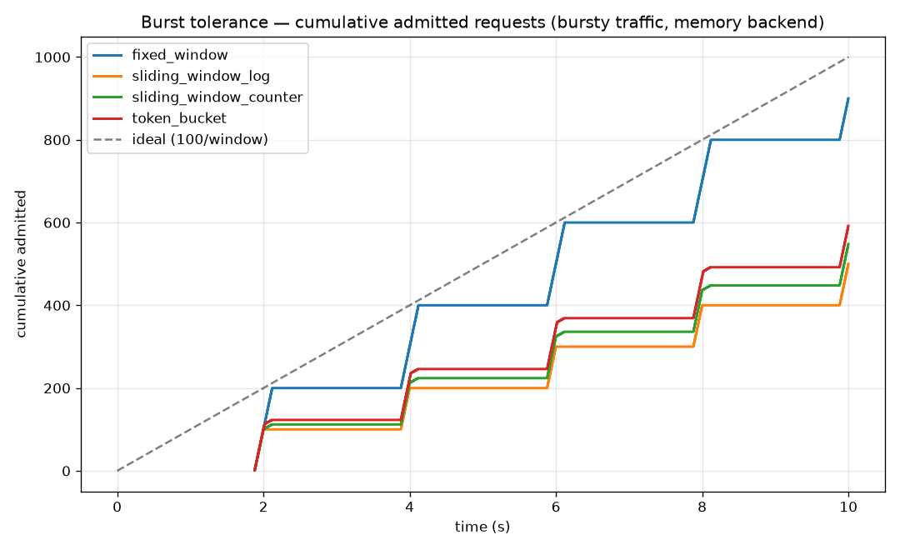
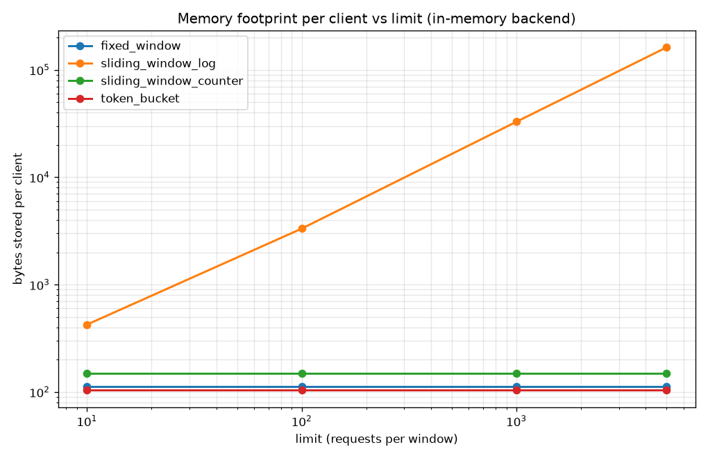
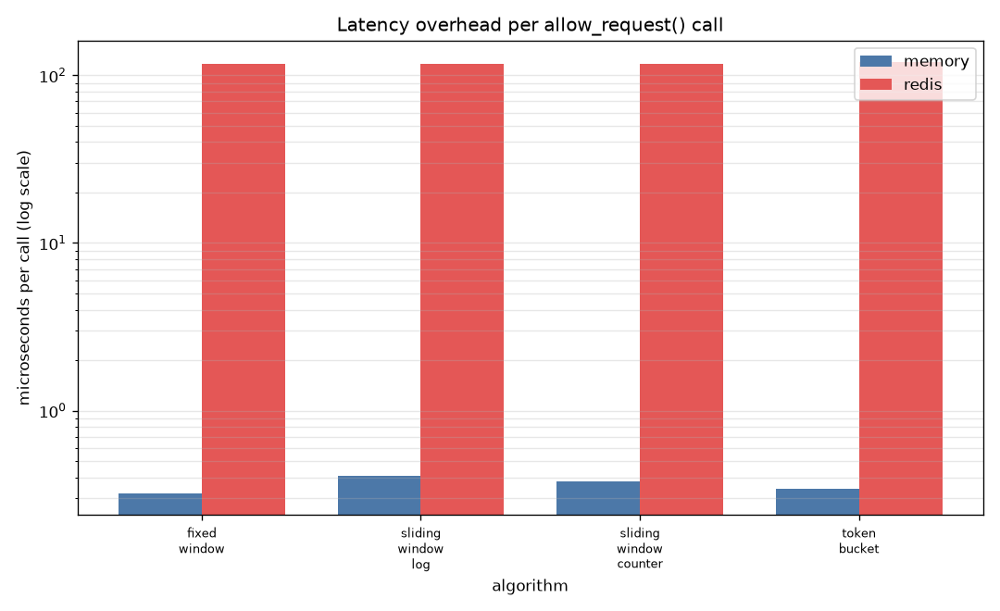
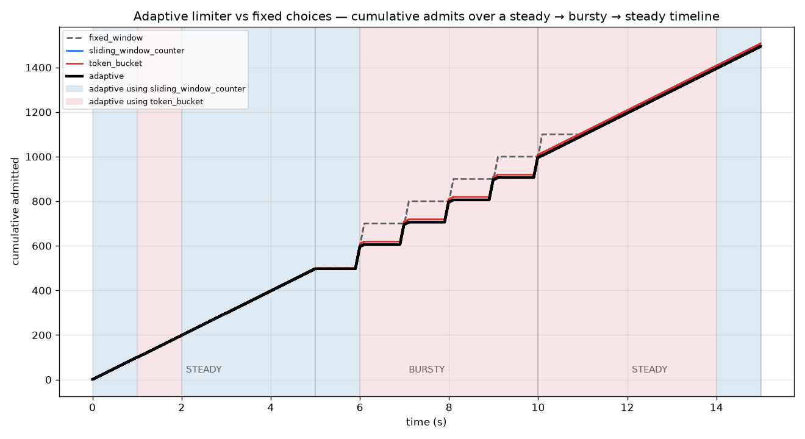

# rate-limiter-lab

Four rate-limiting algorithms behind **one interface**, each runnable against an
**in-memory** backend (single process) or a **Redis** backend (multi-instance
correct, via atomic Lua scripting). Ships with a benchmark harness that drives
constant, bursty, and ramping traffic through every algorithm/backend
combination, and a FastAPI middleware that turns the winner into reusable
production code.

The point isn't "implement a rate limiter" — it's to **measure** how the four
classic algorithms actually differ and let the numbers pick the default.

---

## The four algorithms

| Algorithm | Core idea | Memory/client | Burst behaviour |
|---|---|---|---|
| **Fixed Window Counter** | Count per fixed clock bucket, reset at the boundary | O(1) | Leaky: admits ~2x at boundaries |
| **Sliding Window Log** | One timestamp per request; count those in the trailing window | **O(limit)** | Exact |
| **Sliding Window Counter** | Weighted blend of current + previous window counts | O(1) | Near-exact |
| **Token Bucket** | Bucket refills at a fixed rate; each request spends a token | O(1) | Tunable burst up to bucket size |

---

## Architecture — how one interface fits four algorithms and two backends

Every algorithm subclasses `RateLimiter` and exposes exactly one public method,
`allow_request(client_id) -> bool`. The trick that keeps algorithm logic and
storage fully separate is that each algorithm expresses its atomic
*read-counter → decide → write-counter* step **twice**:

- a **pure-Python callable** (`_py_op`), run under a lock by the in-memory backend, and
- an equivalent **Lua script** (`LUA`), run atomically by Redis.

A backend knows nothing about which algorithm it runs — it only knows how to
execute one of those two forms atomically. That is what makes swapping in-memory
→ Redis (for correctness across many server instances) a **one-line config
change** with zero edits to algorithm code.

```
        allow_request(client_id)
                 │
        RateLimiter subclass  ── builds numeric args, picks key
                 │
          Backend.execute(py_op, lua, keys, args)
            ┌────┴─────────────┐
   MemoryBackend           RedisBackend
   (lock + dict,           (EVALSHA the Lua script,
    runs py_op)             atomic across processes)
```

See `ratelimiter/base.py` for the contract and any algorithm file (e.g.
`ratelimiter/token_bucket.py`) for the paired Python/Lua implementations.

---

## Quick start

```bash
python -m venv .venv && source .venv/bin/activate
pip install -e ".[all]"

# use the library directly
python -c "from ratelimiter import build_limiter; \
rl = build_limiter('token_bucket','memory',limit=5,window=60); \
print([rl.allow_request('me') for _ in range(7)])"
# -> [True, True, True, True, True, False, False]

# run the test suite (Redis tests auto-skip if no Redis is running)
pytest -q
```

## Run the demo app

```bash
uvicorn demo_app.main:app --reload
# in another shell — send more than the limit and watch for 429s:
for i in $(seq 1 15); do curl -s -o /dev/null -w "%{http_code}\n" localhost:8000/ping; done
```

Everything is env-configured: `RL_ALGORITHM`, `RL_BACKEND`, `RL_LIMIT`,
`RL_WINDOW`, `RL_REDIS_URL`.

## Prove multi-instance correctness (the Redis payoff)

```bash
docker compose up -d --build          # Redis + two demo instances (:8001, :8002)

# 16 requests split across BOTH instances, same client id:
for i in $(seq 1 16); do
  port=$([ $((i%2)) -eq 1 ] && echo 8001 || echo 8002)
  curl -s -o /dev/null -w "%{http_code}\n" -H "X-Client-Id: alice" localhost:$port/ping
done
# -> ten 200s then 429s. The limit of 10 is shared across the two processes,
#    not enforced 10-per-instance. Atomic Lua scripting is what guarantees this.
```

Measured: two instances behind one Redis admitted **exactly 10** total (limit=10)
then 429'd — from two distinct container hostnames.

## Run the benchmark

```bash
python benchmark/run_benchmarks.py
# writes CSVs + PNGs into benchmark/results/
```

---

## Findings

All numbers below are **measured**, not estimated (`limit=100`, `window=1s`,
10s of simulated traffic per shape; full data in `benchmark/results/*.csv`).
Memory and Redis backends produced identical admit/reject decisions in every
scenario — confirming the two backends implement the same algorithms.

### 1. Burst tolerance — the headline

Worst-case **admitted requests inside any single trailing window** during the
bursty scenario (a correct limiter should never exceed the limit of 100):

| Algorithm | Peak admits / window | Verdict |
|---|---:|---|
| Fixed Window | **200** | 2x overshoot at boundaries — the classic flaw, reproduced |
| Sliding Window Log | **100** | Exact — never exceeds the limit |
| Sliding Window Counter | **112** | Near-exact; small approximation error |
| Token Bucket | **123** | Deliberate burst allowance |



Fixed Window climbs in **+200 steps** at each boundary-straddling burst; the true
sliding window holds every burst to 100.

### 2. Memory footprint — the other clean separation

Bytes stored per client as the limit grows (in-memory backend):

| limit | Fixed Window | Sliding **Log** | Sliding Counter | Token Bucket |
|---:|---:|---:|---:|---:|
| 10 | 112 B | 424 B | 148 B | 104 B |
| 100 | 112 B | 3.3 KB | 148 B | 104 B |
| 1000 | 112 B | 32.9 KB | 148 B | 104 B |
| 5000 | 112 B | **161.9 KB** | 148 B | 104 B |



The Sliding Window Log is **O(limit)** — ~1000x heavier than the others at
`limit=5000` — because it stores one timestamp per in-window request. Every other
algorithm is flat O(1). (Redis reports the same story: 456 B → 595 KB for the log.)

### 3. Latency overhead

Per `allow_request()` call, averaged over thousands of calls:

| Backend | Cost / call | Notes |
|---|---:|---|
| in-memory | ~0.3–0.4 µs | dict + lock; algorithm choice barely matters |
| Redis (localhost) | ~117–120 µs | dominated by the network round-trip, not the Lua |



Backend choice moves latency by **~350x**; algorithm choice is noise next to it.
Redis buys multi-instance correctness at the price of a network hop.

### Which one wins?

**It depends on the goal, and the data says so clearly:**

- **Sliding Window Counter is the best general-purpose default.** It matches the
  Sliding Window Log's accuracy (peak 112 vs 100) at **flat O(1) memory** (148 B
  vs up to 162 KB) and identical latency. You get sliding-window quality without
  the log's memory blow-up.
- **Token Bucket** is the pick when short bursts are a *feature* — it admits
  tuned bursts (peak 123–161) while holding the long-run average to the limit.
- **Sliding Window Log** is the accuracy gold standard but only worth its memory
  cost at small limits or when exactness is non-negotiable.
- **Fixed Window** is the cheapest and simplest, but its 2x boundary overshoot
  makes it the weakest choice for real abuse protection.

---

## Adaptive limiter — switching algorithm by observed traffic shape

The benchmark shows each algorithm makes a fixed trade-off. `AdaptiveRateLimiter`
(in `ratelimiter/adaptive.py`) watches **each client's** traffic online and routes
it to whichever algorithm fits its *current* shape — no advance decision required.

- **Detection** (`TrafficDetector`): buckets recent arrivals into time bins over a
  rolling horizon and uses the **peak-to-mean ratio** as a burstiness index
  (evenly spaced → ~1 → steady; tight clusters + idle → spike → bursty; rising
  bins → ramping). Binning over *time* rather than a fixed count of gaps is what
  keeps a dense burst from hiding the surrounding idle period.
- **Policy** (configurable): the default *tolerant* policy is
  `steady → sliding_window_counter`, `bursty → token_bucket`; a `STRICT_POLICY`
  swaps `bursty → sliding_window_log`.

### The correctness catch (and the fix)

Naive switching is **exploitable**: a freshly activated algorithm starts with an
empty counter, so a mid-window switch hands the client a *second* full allowance
(2x the limit). Two mechanisms prevent this:

1. **Switch only at window boundaries** — within any one window exactly one
   algorithm governs, so no counter is ever reset mid-window.
2. **Prime on hand-off** — the incoming algorithm is seeded to a saturated state
   (token bucket emptied, log filled) so it grants no fresh burst on top of what
   the outgoing one already allowed in the adjacent window.

Both are tested. Before the fix, the adaptive limiter peaked at **200 admits/window**
during bursts (as bad as Fixed Window); after it, **109** — see below.

### Evaluation — steady → bursty → steady, no advance knowledge

`python benchmark/adaptive_eval.py` runs one mixed timeline through four strategies
(`limit=100/1s`). Peak admits per window (should stay near 100):

| Strategy | Steady peak | **Bursty peak** | Bursty admitted |
|---|---:|---:|---:|
| Fixed Window | 101 | **200** | 500 |
| Sliding Window Counter | 101 | 110 | 500 |
| Token Bucket | 101 | 119 | 509 |
| **Adaptive** | 101 | **109** | 499 |



The shaded bands show which algorithm the adaptive limiter selected over time; it
made 4 switches and tracked the appropriate algorithm per phase automatically.

### Does adaptation actually help? (honest answer)

**On this workload, only marginally — and that's a real finding, not a failure.**
A shape-robust single algorithm (Sliding Window Counter) already handles steady,
bursty, and ramping traffic well, so adaptive lands right next to it in the
numbers. Adaptive's clear win is only over **Fixed Window** (109 vs 200 peak) — but
so is just *using* the counter.

Where the adaptive layer genuinely earns its keep:

- **You don't have to pre-commit to one algorithm** — it can't overshoot like
  Fixed Window even if that's what a client's traffic would otherwise trigger.
- **Per-client, per-shape policy** in one limiter — a bursty client can get
  token-bucket tolerance while a steady client gets counter precision,
  simultaneously, which no single-algorithm limiter offers.
- **Cost-adaptive strict mode** — with `STRICT_POLICY`, a client pays the Sliding
  Window Log's O(limit) memory *only while it is actually bursty*, not always.

And the safety mechanism has a cost worth naming: priming the incoming algorithm
means adaptive gives up token-bucket's burst *absorption* advantage right after a
switch — so "safe adaptation" converges toward the robust single algorithm. That
tension (burst reward vs. switch safety) is the honest takeaway.

```python
from ratelimiter import build_limiter
from ratelimiter.adaptive import STRICT_POLICY

rl = build_limiter("adaptive", "redis", limit=100, window=60)      # tolerant default
rl = build_limiter("adaptive", "memory", limit=100, window=60,
                   policy=STRICT_POLICY, min_dwell_windows=3)        # strict, slower to switch
rl.stats("client-42")   # -> {'active': 'token_bucket', 'last_shape': 'bursty', 'switches': 2}
```

---

## Designed for reuse

`ratelimiter/` contains **no application-specific code**. The middleware takes
its algorithm, backend, limit, and client-key function as configuration, so a
second project can mount several limiters with different policies. For example, a
URL shortener applying a strict limit to writes and a loose one to reads:

```python
from fastapi import FastAPI
from ratelimiter import build_limiter
from ratelimiter.middleware import RateLimitMiddleware

app = FastAPI()

# strict: 5 writes/min on the create endpoint
writes = build_limiter("token_bucket", "redis", limit=5, window=60, namespace="writes")
# loose: 1000 reads/min on the redirect endpoint
reads = build_limiter("sliding_window_counter", "redis", limit=1000, window=60, namespace="reads")

# mount per-router, or select the limiter inside a dependency by path — the
# library imposes no policy of its own.
```

Install it into another project straight from this repo:

```bash
pip install -e /path/to/rate-limiter-lab      # editable
# or
pip install git+https://github.com/gthapaswin/rate-limiter-lab.git
```

---

## Repository layout

```
ratelimiter/            # the reusable library (this is what gets packaged)
  base.py               # RateLimiter interface + shared allow_request flow
  fixed_window.py       # each algorithm: paired _py_op (Python) + LUA (Redis)
  sliding_window_log.py
  sliding_window_counter.py
  token_bucket.py
  traffic_detector.py   # online traffic-shape classifier
  adaptive.py           # AdaptiveRateLimiter: per-client algorithm switching
  backends/
    memory.py           # lock + dict
    redis_backend.py    # register_script / EVALSHA, atomic across instances
  middleware.py         # generic FastAPI middleware
demo_app/main.py        # env-configured demo, used for the 2-instance test
benchmark/              # load_generator.py, run_benchmarks.py, adaptive_eval.py, results/
tests/
  test_algorithms.py    # one parametrized suite over the 4 algorithms x backends
  test_adaptive.py      # adaptive limiter: contract, anti-exploit, switching
```

## Testing

```bash
pytest -q          # 32 tests: 4 algorithms x 2 backends x 4 contract tests
```

The suite parametrizes over the algorithm registry, so every algorithm is held
to the same contract automatically. Redis-backed cases skip cleanly when no
Redis is reachable.
